### 카드 상품 추천 및 조회 웹 애플리케이션
#  픽카

### 배경
- **다양한 선택지** : 다양한 신용카드 중 자신에게 맞는 카드를 찾는 것은 매우 복잡하고 많은 시간을 소요합니다.
- **맞춤형 정보 부족** : 대부분의 카드는 개별 사용자의 구체적인 필요 사항과 일치하지 않을 수 있습니다.
- **정보의 비대칭성** : 소비자들은 카드 혜택에 대한 정확한 정보와 분석 내용을 얻기 어렵습니다.

### 목적
카드 추천 프로젝트는 이러한 문제를 해결하고자 합니다. 본 프로젝트의 주요 목적은 다음과 같습니다.
- **사용자 맞춤형 추천** : 사용자의 소비 패턴과 라이프스타일을 분석하여 적합한 신용카드를 추천합니다.
- **정보 제공** : 신용카드의 혜택과 조건을 명확하고 쉽게 이해할 수 있도록 정보를 제공합니다.
- **의사결정 지원** : 사용자가 보다 현명한 금융 결정을 내릴 수 있도록 돕습니다.


## 📓 목차
1. [⭐ 팀원 및 역할 ⭐](#🦸-팀원-및-역할)
2. [⭐ 기술 스택 및 설계 내용 ⭐](#📚-기술-스택-및-설계-내용)
3. [⭐ 크롤링을 통한 데이터 수집 ⭐](#💾-크롤링을-통한-데이터-수집)
4. [⭐ 카드 상품 추천 알고리즘 ⭐](#💳-카드-상품-추천-알고리즘)
5. [⭐ AI 적용 내용 ⭐](#🧭-ai-적용-내용) 
6. [⭐ 주요 기능 소개 ⭐](#🧰-주요-기능-소개) 


## 🦸 팀원 및 역할

|이름|역할 및 구현 기능|
|---|---|
|임경태<br>(팀장)|**Back End** - 카드 상품 추천 알고리즘 설계 및 구현, 카드 상품 정보 크롤링, 카드별 카테고리화, 유저 정보 커스터마이징, 게시판 & 댓글 CRUD, ERD 작성 등<br>**Front End** - 카드 조회 필터링 및 정렬, 게시판 & 댓글, 회원 인증 관리, 백엔드와 전반적 기능 연결 등|
|윤예리|**Front End** - 카드 추천을 위한 설문 설계 및 구현, 전반적 페이지 레이아웃 설계(Figma) 및 구현, 애플리케이션 컨셉 구상, 지도 API(Kakao) - 주변 은행 검색, AI 챗봇 서비스, UX/UI 디자인 등|


## 📚 기술 스택 및 설계 내용

### 💎 기술 스택
|Development Area|language|Framework|Library|
|---|---|---|---|
|FRONTEND|||Axios, Pinia (+ pinia-plugin-persistedstate), Bootstrap-Vue-3, vue-router, vue3-kakao-maps
|BACKEND|||Django-Rest-Framework, Django-CORS-Headers, dj-rest-auth, Selenium, Pandas, Numpy

### 💎 설계 내용
#### FRONTEND - Page Layout


#### BACKEND - ERD


## 💾 크롤링을 통한 데이터 수집
### 💎 selenium을 이용한 크롤링 사용

```python
# 1. 브라우저 인스턴스를 생성하고 제어
# 2. Chrome 브라우저의 실행 옵션을 설정하는 데 사용
# 3. Selenium에서 웹 요소를 찾는 데 사용되는 위치 전략을 정의 (웹 요소 지정)
# 4. 지정한 윈도우나 탭을 찾을 수 없을 때 발생하는 예외 처리
from selenium import webdriver  # 1
from selenium.webdriver.chrome.options import Options  # 2
from selenium.webdriver.common.by import By  # 3
from selenium.common.exceptions import NoSuchWindowException, NoSuchElementException  # 4
import csv

...

# 크롬 드라이버 인스턴스
driver = webdriver.Chrome(options=chrome_options)

# CSV 파일 생성 (저장 경로, 쓰기 모드, 인코딩, 줄바꿈 없음으로 조정)
static_dir = "cards"
csv_data1 = open(f"{static_dir}/card_data.csv", "w", encoding="CP949", newline="")
csv_data2 = open(f"{static_dir}/benefit_data.csv", "w", encoding="CP949", newline="")
card_data = csv.writer(csv_data1)
benefit_data = csv.writer(csv_data2)

...

# 이름
card_name = driver.find_element(
    By.CSS_SELECTOR, f"{CARD_URL} > div.data_area > div.tit > strong"
).text
# 브랜드
card_brand = driver.find_element(
    By.CSS_SELECTOR, f"{CARD_URL} > div.data_area > div.tit > p"
).text
# 이미지
card_image = driver.find_element(
    By.CSS_SELECTOR, f"{CARD_URL} > div.plate_area > div.card_img > img"
).get_attribute("src")

...
```
- 카드고릴라 웹사이트에서 필요한 데이터를 수집하기 위해 웹 크롤링 기법을 사용했습니다.
  
  이 과정을 통해 카드에 대한 정확하고 상세한 정보를 확보할 수 있었으며, 이를 바탕으로 프로젝트를 진행하였습니다.

  코드는 [ClassCard](https://github.com/ClassCardMLP/ClassCard)를 참고했습니다.


## 💳 카드 상품 추천 알고리즘
### 💎 콘텐츠 기반 필터링 (Content-Based Filtering)
사용자의 관심사와 카드의 혜택을 매칭하여 카드를 추천하는 방법
1. **사용자 프로파일 생성** : 사용자가 제공한 정보(설문)를 바탕으로 프로파일을 생성한다.
```python
user_profile = [1, 1, 0, 0, 1, 0, 1, 1]  # 주유, 하이패스, 배달앱, 스포츠 관람 등
```
2. **카드 속성 정의** : 각 카드의 혜택과 속성을 정의한다.
```python
# 카드 1 : 병원/약국, 마트/편의점, 쇼핑, 주유
# 카드 2 : 주유, 비즈니스, 자동차/하이패스
# 카드 3 : 바우처, 프리미엄, 항공마일리지, 적립
# ...
cards = Card.objects.all().order_by("annual_fee1", "record")
benefit_matrix = []  # 혜택 벡터 배열을 가지는 혜택 행렬
for card in cards:
    benefits = card.benefit_set.all()
    benefit = [bn.title for bn in benefits]  # ['쇼핑', '모든가맹점', '주유', '금융', '통신', '기타', '적립']
    benefit_vector = [0] * (BN + 1)  # 코사인 유사도를 판단하기 위한 벡터 배열
...
```
3. **카드 속성 벡터 매트릭스 생성** : 카드들의 속성을 인덱싱화시켜 벡터로 제작한다.
```python
cards = [
    [1, 1, 1, 0, 1, 0, 1, 0],  # 카드 1
    [0, 1, 0, 1, 1, 1, 0, 1],  # 카드 2
    [1, 0, 0, 0, 1, 0, 1, 1],  # 카드 3
    ...
]
```
4. **유사도 계산** : 사용자의 프로파일과 카드 속성 간의 유사도를 계산한다.
```python
def cosine_similarity(x, y, eps=1e-8):
    nx = x / np.sqrt(np.sum(x**2) + eps)
    ny = y / np.sqrt(np.sum(y**2) + eps)
    return np.dot(nx, ny)

similarities = cosine_similarity(user_profile, cards)
```
5. **카드 추천** : 유사도가 높은 카드들을 추천한다.

### 💎 협업 필터링 (Collaborative Filtering)
1. **사용자-카드 매트릭스 생성** : 사용자들이 사용하거나 선호하는 카드 정보를 매트릭스로 만든다.<br>
    (본 프로젝트에서는 10000개의 리뷰 더미 데이터를 무작위로 생성하였습니다)
```python
    user_card_matrix = {
        1: {123: 5, 456: 3},
        2: {123: 4, 789: 8},
        3: {473: 7, 921: 5},
        ...
    }
```
2. **유사 사용자 찾기** : 사용자 간의 유사도를 계산하여 비슷한 사용자들을 찾는다.
```python
# 전체 유사도 = (협업 유사도 + 성별 유사도 + 나이 유사도) / 3
current_user_vector = [my_ratings[card] for card in common_cards]
other_user_vector = [other_ratings[card] for card in common_cards]

recommend_similarity = cosine_similarity(current_user_vector, other_user_vector)
overall_similarity = (recommend_similarity + gender_similarity + age_similarity) / 3
```
3. **카드 추천** : 유사한 사용자가 선호하는 카드를 추천한다.
```python
# 유사도가 높은 순으로 정렬
coop_similarity_vector.sort(reverse=True)

# 상위 N명의 사용자를 기반으로 카드 추천
top_n_users = [
    user_id for _, user_id in coop_similarity_vector[:20]
]  # 상위 20명 선택 / 예시: [186, 372, 474, 5, 63, ...]
recommended_cards = {}  # 예시: {789: [5, 4], 1011: [4, 4, 3], ...}
for user_id in top_n_users:
    for card_id, rating in user_card_matrix[user_id].items():
        if card_id not in my_ratings:
            if card_id not in recommended_cards:
                recommended_cards[card_id] = []
            recommended_cards[card_id].append(rating)

# 평균 평점이 높은 카드 선택
recommended_cards = sorted(recommended_cards.items(), key=lambda x: np.mean(x[1]), reverse=True)
recommended_card_pks_coop = [card_id for card_id, _ in recommended_cards[:5]]
```


## 🧭 AI 적용 내용

### 💎 SandBird Chatbot
```python
//app.vue
!function(w, d, s, ...args){
    var div = d.createElement('div')
    div.id = 'aichatbot'
    d.body.appendChild(div)
    w.chatbotConfig = args
    var f = d.getElementsByTagName(s)[0],
    j = d.createElement(s)
    j.defer = true
    j.type = 'module'
    j.src = 'https://aichatbot.sendbird.com/index.js'
    f.parentNode.insertBefore(j, f)
}(window, document, 'script', 'C70DB29C-C1EF-407A-98F7-175C6AA6BBC6', 'onboarding_bot', {
    apiHost: 'https://api-cf-ap-2.sendbird.com',
})
```

### 💎 Chat-GPT 4o
```markdown
Q. 카드 추천 알고리즘에 어떤 알고리즘을 사용하는 것이 적합할까?


A. 카드 추천 알고리즘에 어떤 알고리즘을 사용할지 결정하는 것은 데이터의 종류와 추천의 목적에 따라 다릅니다. 일반적으로 많이 사용되는 알고리즘은 다음과 같습니다:

    1. 협업 필터링 (Collaborative Filtering): 사용자 행동 데이터를 기반으로 다른 사용자가 좋아하는 카드를 추천합니다. 대표적으로 다음 두 가지 방식이 있습니다:

        - 사용자 기반 협업 필터링 (User-based Collaborative Filtering): 비슷한 취향을 가진 사용자가 좋아한 카드를 추천합니다.

        - 아이템 기반 협업 필터링 (Item-based Collaborative Filtering): 사용자가 좋아하는 카드와 비슷한 카드를 추천합니다.

    2. 콘텐츠 기반 필터링 (Content-Based Filtering): 카드의 특성 데이터를 사용하여 사용자가 이전에 좋아했던 카드와 유사한 카드를 추천합니다.

    3. 행동 기반 추천 (Behavioral Recommendations): 사용자의 클릭, 구매, 검색 등의 행동을 분석하여 추천합니다.

    4. 하이브리드 방법 (Hybrid Methods): 위의 여러 가지 방법을 결합하여 더 정확한 추천을 제공합니다.

    5. 기계 학습 알고리즘 (Machine Learning Algorithms): 사용자의 프로필, 행동 데이터 등을 사용하여 다양한 모델 (예: 딥러닝, 랜덤 포레스트 등)을 통해 추천합니다.

    6. 딥러닝 기반 알고리즘 (Deep Learning-Based Algorithms): 특히 대규모 데이터에서 성능이 좋은 신경망 기반 모델을 사용합니다.
       예를 들어, 순환 신경망(RNN)이나 컨볼루션 신경망(CNN)을 사용한 추천 시스템이 있습니다.

카드 추천 알고리즘을 선택할 때는 데이터의 양과 질, 비즈니스 목표 등을 고려하여 가장 적합한 방식을 선택하는 것이 중요합니다.
```

## 🧰 주요 기능 소개

### 💎 메인 페이지
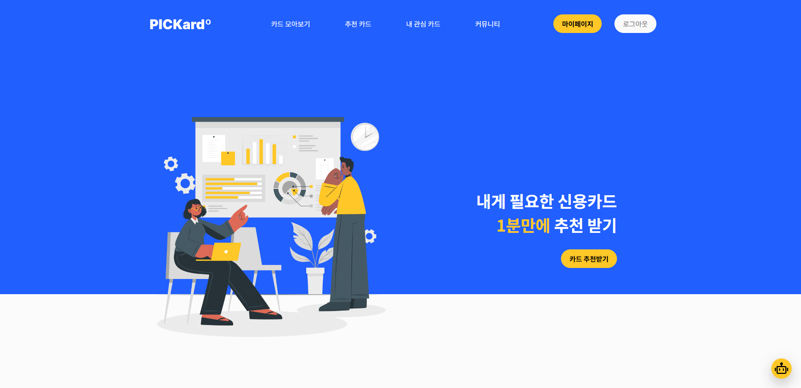

### 💎 로그인, 회원가입 페이지
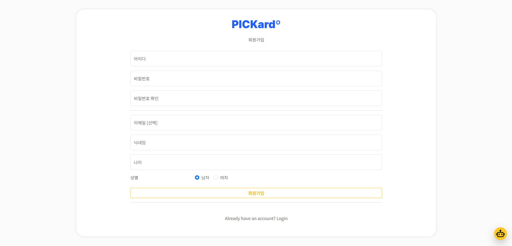
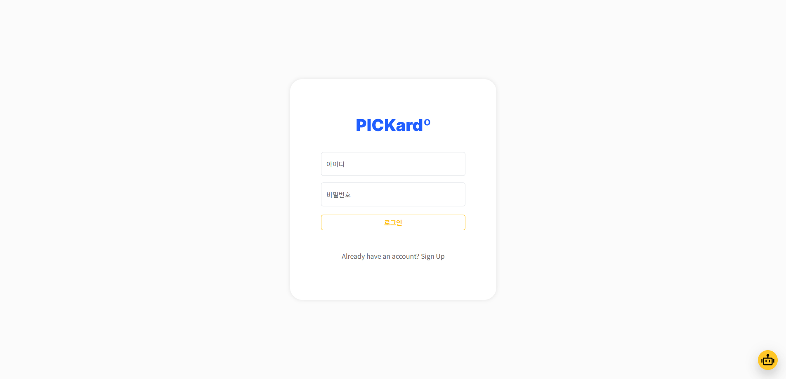

- CustomAccountAdapter를 사용하여 DefaultAccountAdapter 오버라이딩하여 커스텀 폼을 제작하였습니다.
- 잘못된 정보 입력 시 유효성 검사를 통한 에러메세지가 표시되게 하였습니다.

### 💎 마이 페이지
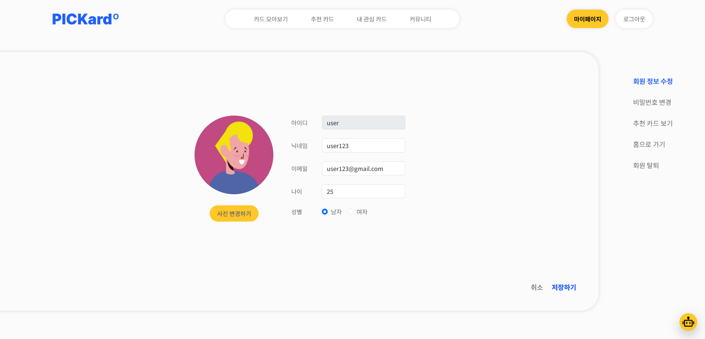

- 마이페이지에는 개인 정보를 조회 & 수정이 가능하게 하였고, 추천된 카드를 볼 수 있는 링크 버튼이 있습니다.

### 💎 설문 페이지

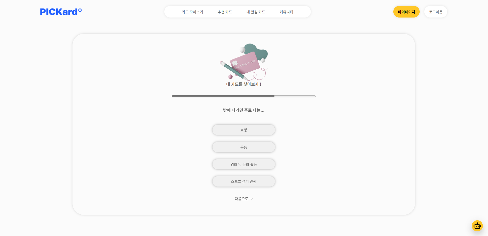

- 많은 카테고리를 분류할 수 있는 질문을 기획하였고, 사용자가 읽기 편한 감성의 어조를 사용하였습니다.

### 💎 추천 페이지


- 설문을 통해 도출된 정보를 이용해 카드를 추천하였습니다.

### 💎 카드 조회 페이지
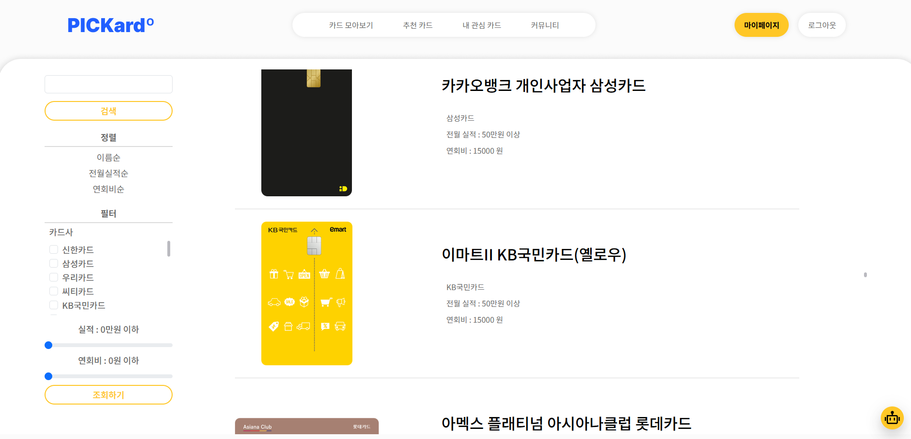
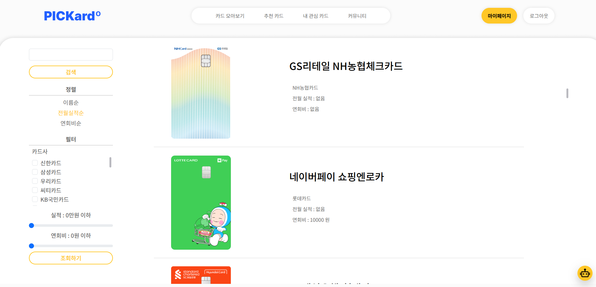
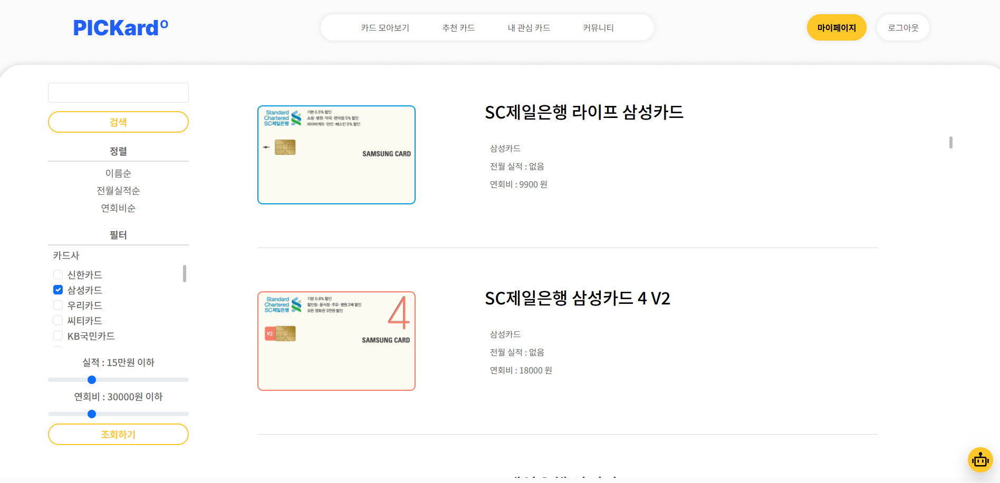
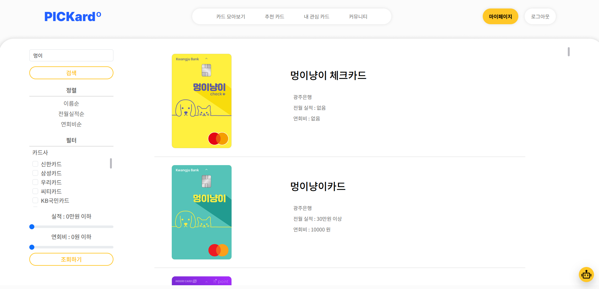

- 크게 검색 및 정렬, 필터, 카드 리스트 부분으로 나뉘어 있습니다.
- 검색 : 키워드를 입력하여 특정 카드를 검색할 수 있습니다.
- 정렬 : 이름순, 전월실적순, 연회비순으로 카드를 정렬할 수 있습니다.
- 필터 (단어) : 카드사를 중복으로 선택할 수 있는 체크박스가 있습니다.
- 필터 (범위) : 실적 및 연회비에 대한 슬라이더가 있어 사용자가 원하는 범위를 설정할 수 있습니다.
- '조회하기' 버튼을 눌러 필터 조건에 맞는 카드를 검색할 수 있습니다.
- 페이지의 메인 부분에는 카드 리스트가 나열되어 있으며, 각 카드에는 카드 이미지와 함께 카드 이름, 카드사, 전월 실적, 연회비 등의 정보가 제공됩니다.
- 카드 리스트는 무한 스크롤을 통해 더 많은 카드를 확인할 수 있어 사용자 경험이 개선될 수 있습니다.

### 💎 카드 세부 페이지
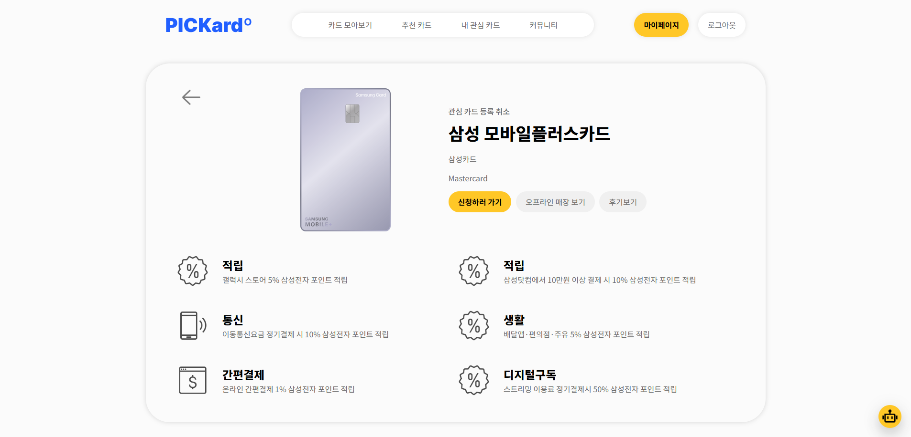
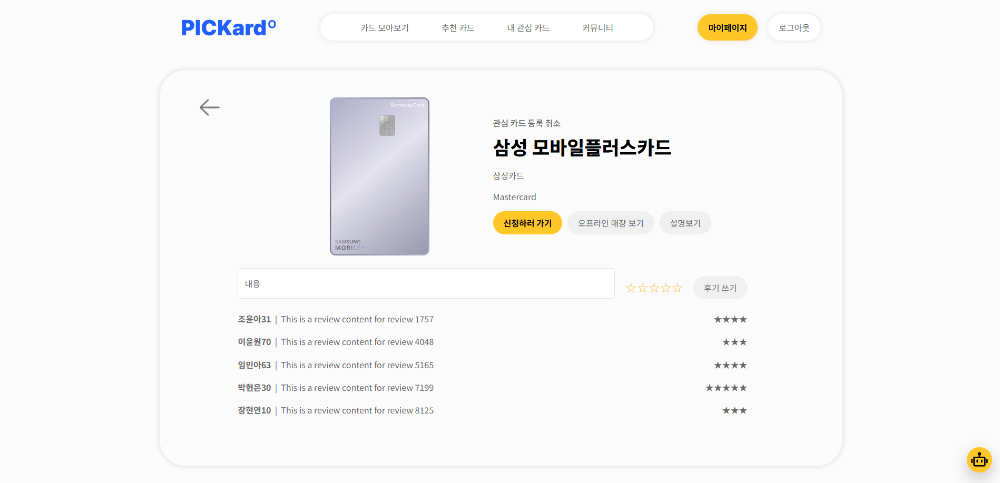


- 화면 중앙에는 카드의 이미지가 있으며, 카드 이름과 카드사가 표시되어 있습니다.
- '신청하러 가기', '오프라인 매장 보기', '후기 보기' 버튼이 있어 사용자에게 추가적인 행동을 유도합니다.
- 카드의 주요 혜택이 아이콘과 함께 요약되어 있어 상세 정보를 쉽게 확인할 수 있습니다.
- 오프라인 매장 보기 : 근처 카드사나 은행을 마킹한 지도(카카오 맵 API)가 있습니다.
- 후기 보기 : 유저의 후기를 통해 추가 정보를 습득하고, 카드 추천 알고리즘의 신뢰도를 향상시킵니다.

### 💎 관심 카드 페이지
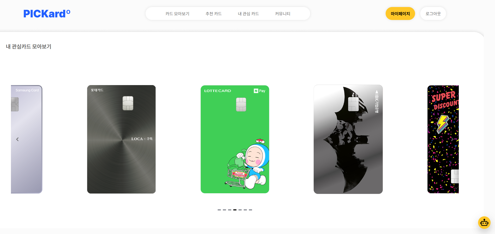

- 사용자가 관심 목록에 추가한 카드들이 나열되어 있습니다.
- 각 카드는 호버 이벤트 시 카드 이름이 표시됩니다.
- 카드가 1초마다 옆으로 이동하는 애니메이션이 적용되어 있어 사용자가 여러 카드를 한눈에 확인할 수 있도록 도와주며, 사용자에게 동적이고 흥미로운 경험을 제공합니다.

### 💎 커뮤니티 페이지
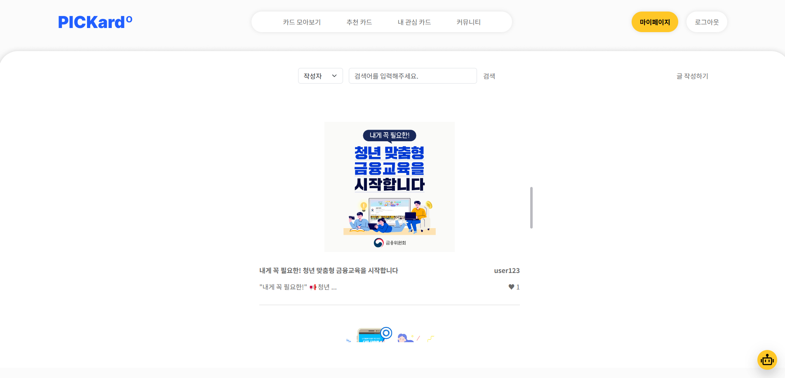
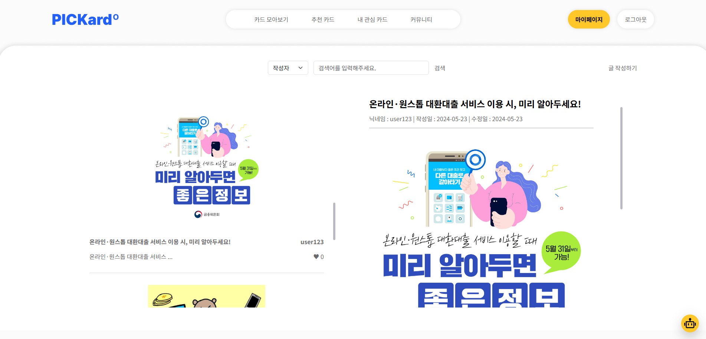
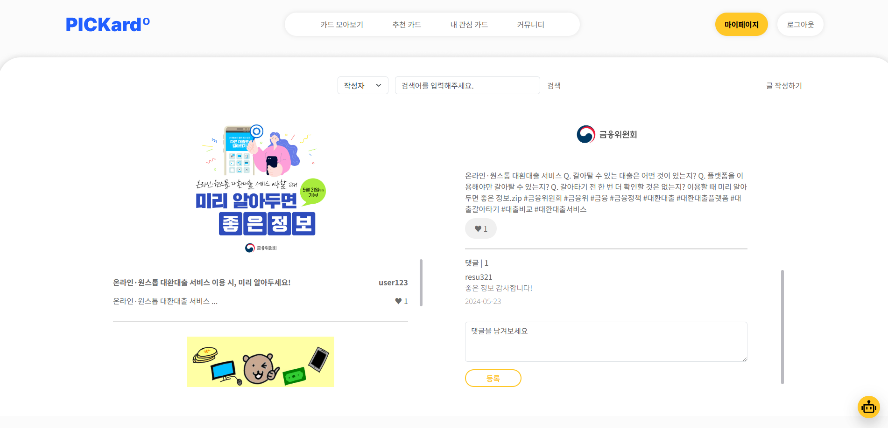
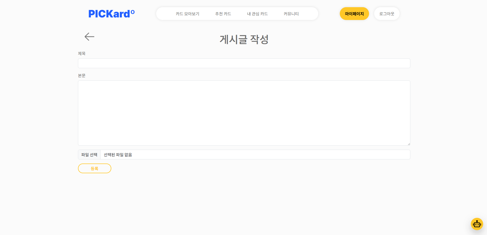

- 금융에 유익한 정보를 제공하는 커뮤니티로 사용될 수 있습니다.
- 게시글 리스트에는 게시글의 간략한 목록이 표시되어 있습니다.
- 검색어를 입력할 수 있는 검색창과 작성자 필터가 있어, 사용자가 특정 게시글을 검색하거나 특정 작성자의 게시글을 볼 수 있습니다.
- 사용자가 특정 게시글을 클릭하면 페이지가 이동하는 대신, 오른쪽에 해당 게시글의 상세 내용이 표시됩니다. 상세 내용과 더불어 댓글과 좋아요 기능까지 구현되어 사용자 간의 상호작용을 원할하게 합니다.
- 사용자가 다양한 게시글을 쉽게 탐색하고, 상세 내용을 빠르게 확인할 수 있도록 설계되어 있어, 커뮤니티 내 정보 교류를 원활하게 합니다.
- 게시글 생성 시 사진을 첨부할 수 있어 시각 정보를 이용하기에 좋습니다.

### 💎 챗봇 페이지
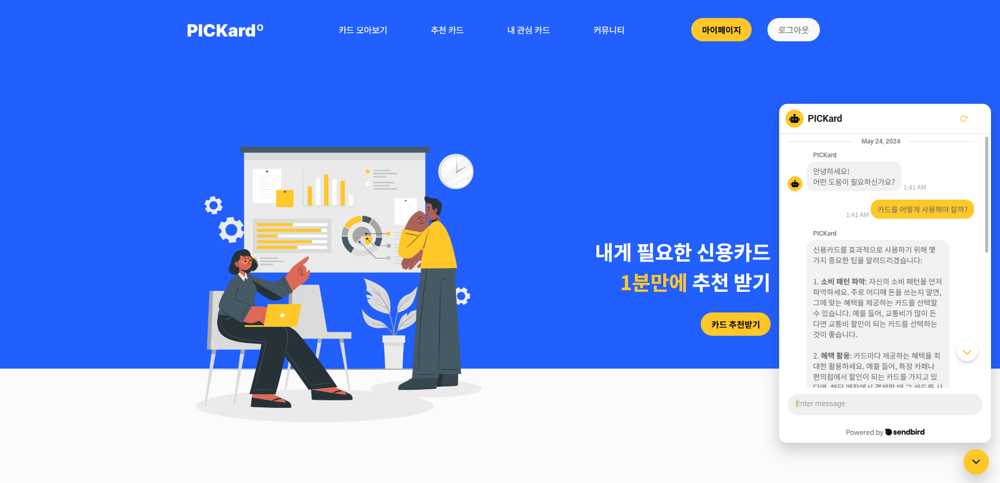

- sendbird api를 사용하여 특정 웹 페이지의 정보를 학습한 챗봇 기능을 구현했습니다.
- 페이지의 오른쪽 하단에 챗봇이 자리하고 있습니다.
- 챗봇은 사용자의 질문에 대해 카드 사용 팁을 제공하며, "소비 패턴 파악", "혜택 활용" 등 다양한 정보를 제공합니다.
- 세부 카드 정보도 쉽게 얻을 수 있도록 돕습니다.
