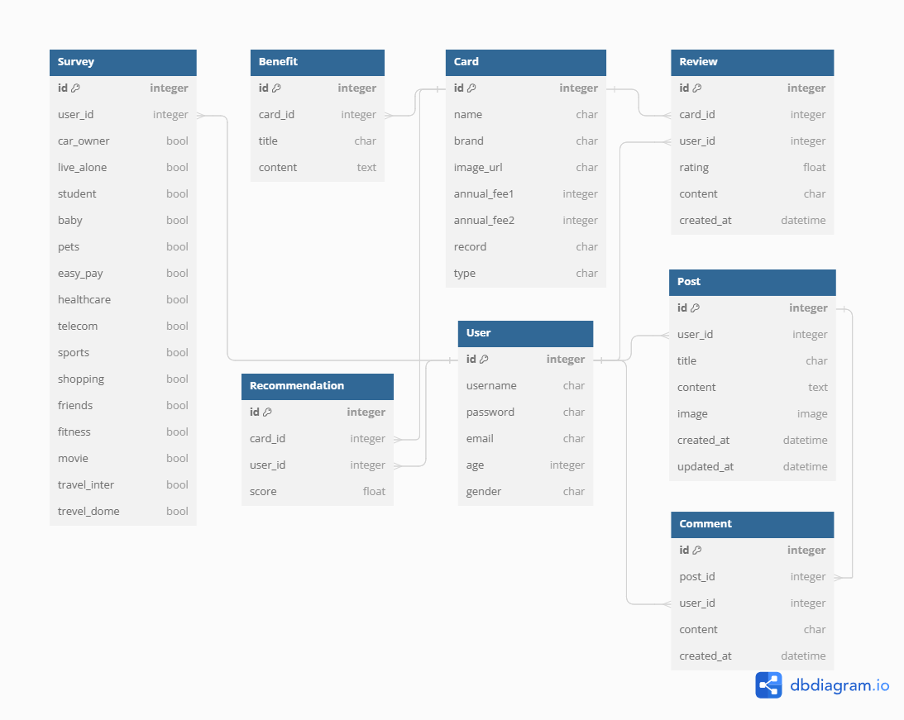

### 카드 상품 추천 및 조회 웹 애플리케이션
#  픽카

### 배경
- **다양한 선택지** : 다양한 신용카드 중 자신에게 맞는 카드를 찾는 것은 매우 복잡하고 많은 시간을 소요합니다.
- **맞춤형 정보 부족** : 대부분의 카드는 개별 사용자의 구체적인 필요 사항과 일치하지 않을 수 있습니다.
- **정보의 비대칭성** : 소비자들은 카드 혜택에 대한 정확한 정보와 분석 내용을 얻기 어렵습니다.

### 목적
카드 추천 프로젝트는 이러한 문제를 해결하고자 합니다. 본 프로젝트의 주요 목적은 다음과 같습니다.
- **사용자 맞춤형 추천** : 사용자의 소비 패턴과 라이프스타일을 분석하여 적합한 신용카드를 추천합니다.
- **정보 제공** : 신용카드의 혜택과 조건을 명확하고 쉽게 이해할 수 있도록 정보를 제공합니다.
- **의사결정 지원** : 사용자가 보다 현명한 금융 결정을 내릴 수 있도록 돕습니다.


## 📓 목차
1. [⭐ 팀원 및 역할 ⭐](#🦸-팀원-및-역할)
2. [⭐ 기술 스택 및 설계 내용 ⭐](#📚-기술-스택-및-설계-내용)
3. [⭐ 카드 상품 추천 알고리즘 ⭐](#💳-카드-상품-추천-알고리즘)
4. [⭐ 주요 기능 소개 ⭐](#🧰-주요-기능-소개) 


## 🦸 팀원 및 역할

|이름|역할 및 구현 기능|
|---|---|
|임경태<br>(팀장)|**Back End** - 카드 상품 추천 알고리즘, 카드 상품 정보 크롤링, 카드별 카테고리화, 유저 정보 커스터마이징, 게시판 & 댓글 CRUD, ERD 작성 등<br>**Front End** - 카드 조회 필터링 및 정렬, 게시판 & 댓글, 회원 인증 관리, 백엔드와 전반적 기능 연결 등|
|윤예리|**Front End** - 카드 추천을 위한 설문 설계 및 구현, 전반적 페이지 레이아웃 설계(Figma) 및 구현, 애플리케이션 컨셉 구상, 지도 API(Kakao) - 주변 은행 검색, 챗봇(예정), CSS, JS 디자인 등|


## 📚 기술 스택 및 설계 내용

### 💎 기술 스택
|Development Area|language|Framework|Library|
|---|---|---|---|
|FRONTEND|||Axios, Pinia (+ pinia-plugin-persistedstate), Bootstrap-Vue-3, vue-router, vue3-kakao-maps
|BACKEND|||Django-Rest-Framework, Django-CORS-Headers, dj-rest-auth, Selenium, Pandas, Numpy

### 💎 설계 내용
#### FRONTEND - Page Layout


#### BACKEND - ERD
추후 업데이트 예정



## 💳 카드 상품 추천 알고리즘
### 💎 콘텐츠 기반 필터링 (Content-Based Filtering)
사용자의 관심사와 카드의 혜택을 매칭하여 카드를 추천하는 방법
1. **사용자 프로파일 생성** : 사용자가 제공한 정보(설문)를 바탕으로 프로파일을 생성한다.
```python
user_profile = [1, 1, 0, 0, 1, 0, 1, 1]  # 주유, 하이패스, 배달앱, 스포츠 관람 등
```
2. **카드 속성 정의** : 각 카드의 혜택과 속성을 정의한다.
```python
# 카드 1 : 병원/약국, 마트/편의점, 쇼핑, 주유
# 카드 2 : 주유, 비즈니스, 자동차/하이패스
# 카드 3 : 바우처, 프리미엄, 항공마일리지, 적립
...
```
3. **카드 속성 벡터 매트릭스 생성** : 카드들의 속성을 인덱싱화시켜 벡터로 제작한다.
```python
cards = [
    [1, 1, 1, 0, 1, 0, 1, 0],  # 카드 1
    [0, 1, 0, 1, 1, 1, 0, 1],  # 카드 2
    [1, 0, 0, 0, 1, 0, 1, 1],  # 카드 3
    ...
]
```
4. **유사도 계산** : 사용자의 프로파일과 카드 속성 간의 유사도를 계산한다.
```python
def cosine_similarity(x, y, eps=1e-8):
    nx = x / np.sqrt(np.sum(x**2) + eps)
    ny = y / np.sqrt(np.sum(y**2) + eps)
    return np.dot(nx, ny)

similarities = cosine_similarity(user_profile, cards)
```
5. **카드 추천** : 유사도가 높은 카드들을 추천한다.

### 💎 협업 필터링 (Collaborative Filtering)
1. **사용자-카드 매트릭스 생성** : 사용자들이 사용하거나 선호하는 카드 정보를 매트릭스로 만든다.
```python

```
2. **유사 사용자 찾기** : 사용자 간의 유사도를 계산하여 비슷한 사용자들을 찾는다.
```python

```
3. **카드 추천** : 유사한 사용자가 선호하는 카드를 추천한다.
```python

```

## 🧰 주요 기능 소개

### 💎 메인 페이지


### 💎 로그인, 회원가입 페이지


### 💎 마이 페이지


### 💎 설문 페이지


### 💎 추천 페이지


### 💎 카드 조회 페이지


### 💎 카드 세부 페이지


### 💎 카드 비교 페이지


### 💎 커뮤니티 페이지


### 💎 챗봇 페이지

