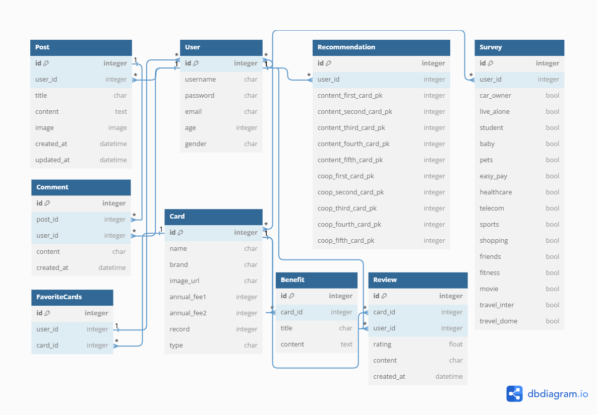

### 카드 상품 추천 및 조회 웹 애플리케이션
#  픽카

### 배경
- **다양한 선택지** : 다양한 신용카드 중 자신에게 맞는 카드를 찾는 것은 매우 복잡하고 많은 시간을 소요합니다.
- **맞춤형 정보 부족** : 대부분의 카드는 개별 사용자의 구체적인 필요 사항과 일치하지 않을 수 있습니다.
- **정보의 비대칭성** : 소비자들은 카드 혜택에 대한 정확한 정보와 분석 내용을 얻기 어렵습니다.

### 목적
카드 추천 프로젝트는 이러한 문제를 해결하고자 합니다. 본 프로젝트의 주요 목적은 다음과 같습니다.
- **사용자 맞춤형 추천** : 사용자의 소비 패턴과 라이프스타일을 분석하여 적합한 신용카드를 추천합니다.
- **정보 제공** : 신용카드의 혜택과 조건을 명확하고 쉽게 이해할 수 있도록 정보를 제공합니다.
- **의사결정 지원** : 사용자가 보다 현명한 금융 결정을 내릴 수 있도록 돕습니다.


## 📓 목차
1. [⭐ 팀원 및 역할 ⭐](#🦸-팀원-및-역할)
2. [⭐ 기술 스택 및 설계 내용 ⭐](#📚-기술-스택-및-설계-내용)
3. [⭐ 카드 상품 추천 알고리즘 ⭐](#💳-카드-상품-추천-알고리즘)
4. [⭐ AI 적용 내용 ⭐](#🧰-AI-적용-내용) 
5. [⭐ 주요 기능 소개 ⭐](#🧰-주요-기능-소개) 


## 🦸 팀원 및 역할

|이름|역할 및 구현 기능|
|---|---|
|임경태<br>(팀장)|**Back End** - 카드 상품 추천 알고리즘, 카드 상품 정보 크롤링, 카드별 카테고리화, 유저 정보 커스터마이징, 게시판 & 댓글 CRUD, ERD 작성 등<br>**Front End** - 카드 조회 필터링 및 정렬, 게시판 & 댓글, 회원 인증 관리, 백엔드와 전반적 기능 연결 등|
|윤예리|**Front End** - 카드 추천을 위한 설문 설계 및 구현, 전반적 페이지 레이아웃 설계(Figma) 및 구현, 애플리케이션 컨셉 구상, 지도 API(Kakao) - 주변 은행 검색, AI 챗봇 서비스, CSS, JS 디자인 등|


## 📚 기술 스택 및 설계 내용

### 💎 기술 스택
|Development Area|language|Framework|Library|
|---|---|---|---|
|FRONTEND|||Axios, Pinia (+ pinia-plugin-persistedstate), Bootstrap-Vue-3, vue-router, vue3-kakao-maps
|BACKEND|||Django-Rest-Framework, Django-CORS-Headers, dj-rest-auth, Selenium, Pandas, Numpy

### 💎 설계 내용
#### FRONTEND - Page Layout


#### BACKEND - ERD
추후 업데이트 예정



## 💳 카드 상품 추천 알고리즘
### 💎 콘텐츠 기반 필터링 (Content-Based Filtering)
사용자의 관심사와 카드의 혜택을 매칭하여 카드를 추천하는 방법
1. **사용자 프로파일 생성** : 사용자가 제공한 정보(설문)를 바탕으로 프로파일을 생성한다.
```python
user_profile = [1, 1, 0, 0, 1, 0, 1, 1]  # 주유, 하이패스, 배달앱, 스포츠 관람 등
```
2. **카드 속성 정의** : 각 카드의 혜택과 속성을 정의한다.
```python
# 카드 1 : 병원/약국, 마트/편의점, 쇼핑, 주유
# 카드 2 : 주유, 비즈니스, 자동차/하이패스
# 카드 3 : 바우처, 프리미엄, 항공마일리지, 적립
# ...
cards = Card.objects.all().order_by("annual_fee1", "record")
benefit_matrix = []  # 혜택 벡터 배열을 가지는 혜택 행렬
for card in cards:
    benefits = card.benefit_set.all()
    benefit = [bn.title for bn in benefits]  # ['쇼핑', '모든가맹점', '주유', '금융', '통신', '기타', '적립']
    benefit_vector = [0] * (BN + 1)  # 코사인 유사도를 판단하기 위한 벡터 배열
...
```
3. **카드 속성 벡터 매트릭스 생성** : 카드들의 속성을 인덱싱화시켜 벡터로 제작한다.
```python
cards = [
    [1, 1, 1, 0, 1, 0, 1, 0],  # 카드 1
    [0, 1, 0, 1, 1, 1, 0, 1],  # 카드 2
    [1, 0, 0, 0, 1, 0, 1, 1],  # 카드 3
    ...
]
```
4. **유사도 계산** : 사용자의 프로파일과 카드 속성 간의 유사도를 계산한다.
```python
def cosine_similarity(x, y, eps=1e-8):
    nx = x / np.sqrt(np.sum(x**2) + eps)
    ny = y / np.sqrt(np.sum(y**2) + eps)
    return np.dot(nx, ny)

similarities = cosine_similarity(user_profile, cards)
```
5. **카드 추천** : 유사도가 높은 카드들을 추천한다.

### 💎 협업 필터링 (Collaborative Filtering)
1. **사용자-카드 매트릭스 생성** : 사용자들이 사용하거나 선호하는 카드 정보를 매트릭스로 만든다.
```python
    user_card_matrix = {
        1: {123: 5, 456: 3},
        2: {123: 4, 789: 8},
        3: {473: 7, 921: 5},
        ...
    }
```
2. **유사 사용자 찾기** : 사용자 간의 유사도를 계산하여 비슷한 사용자들을 찾는다.
```python
# 전체 유사도 = (협업 유사도 + 성별 유사도 + 나이 유사도) / 3
current_user_vector = [my_ratings[card] for card in common_cards]
other_user_vector = [other_ratings[card] for card in common_cards]

recommend_similarity = cos_similarity(current_user_vector, other_user_vector)
overall_similarity = (recommend_similarity + gender_similarity + age_similarity) / 3
```
3. **카드 추천** : 유사한 사용자가 선호하는 카드를 추천한다.
```python
# 유사도가 높은 순으로 정렬
coop_similarity_vector.sort(reverse=True)

# 상위 N명의 사용자를 기반으로 카드 추천
top_n_users = [
    user_id for _, user_id in coop_similarity_vector[:20]
]  # 상위 20명 선택 / 예시: [186, 372, 474, 5, 63, ...]
recommended_cards = {}  # 예시: {789: [5, 4], 1011: [4, 4, 3], ...}
for user_id in top_n_users:
    for card_id, rating in user_card_matrix[user_id].items():
        if card_id not in my_ratings:
            if card_id not in recommended_cards:
                recommended_cards[card_id] = []
            recommended_cards[card_id].append(rating)

# 평균 평점이 높은 카드 선택
recommended_cards = sorted(recommended_cards.items(), key=lambda x: np.mean(x[1]), reverse=True)
recommended_card_pks_coop = [card_id for card_id, _ in recommended_cards[:5]]
```


## 🧰 AI 적용 내용

### 💎 SandBird Chatbot
```python
//app.vue
!function(w, d, s, ...args){
    var div = d.createElement('div')
    div.id = 'aichatbot'
    d.body.appendChild(div)
    w.chatbotConfig = args
    var f = d.getElementsByTagName(s)[0],
    j = d.createElement(s)
    j.defer = true
    j.type = 'module'
    j.src = 'https://aichatbot.sendbird.com/index.js'
    f.parentNode.insertBefore(j, f)
}(window, document, 'script', 'C70DB29C-C1EF-407A-98F7-175C6AA6BBC6', 'onboarding_bot', {
    apiHost: 'https://api-cf-ap-2.sendbird.com',
})
```

### 💎 Chat-GPT 4o
```markdown
```

## 🧰 주요 기능 소개

### 💎 메인 페이지


### 💎 로그인, 회원가입 페이지


### 💎 마이 페이지


### 💎 설문 페이지


### 💎 추천 페이지


### 💎 카드 조회 페이지


### 💎 카드 세부 페이지


### 💎 카드 비교 페이지


### 💎 커뮤니티 페이지


### 💎 챗봇 페이지

